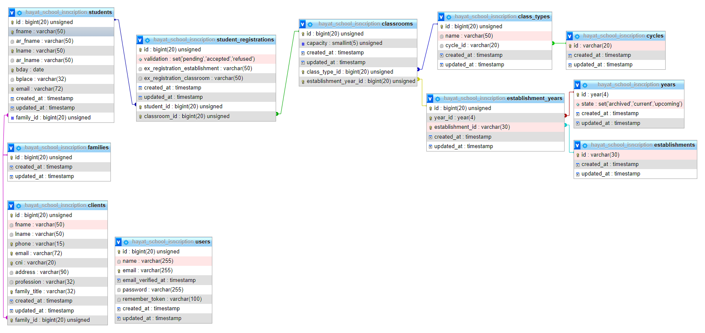

DB
=



## DB notes

The tables **cycles** and **class_types** are seeded with values according to the [algerian educational system](https://education.gov.dz/wp-content/uploads/2015/01/RESTRUCTURATION-DU-POST-OBLIGATOIRE.jpg) to keep data integrity and help in search filtring (joinning).

The creation of an **Establishement** is followed by the creation of records in **establishment_classes** table, that brings all _types_ from **class_types**, and associate them with the **Establishment**.

Admins have to insert a **Year** record then **year_classes** will automatically be filled with rows according to **establishment_classes**.

The **clients** table refers to **parents** :

> Unable to use the word _Parent_ as an eloquent model name. [Ref1](https://laravel.com/docs/8.x/eloquent#table-names) [Ref2](https://www.php.net/manual/en/reserved.php)

```php
class Client extends Model
```

The **parental_links** table is a pure _bridge table_.

About Laravel naming conventions:

-   Only **establishments** & **years** tables do not follow IDs naming convetions.

Due to the non-IT background of the app users and their expected laziness we made the choice of not setting **phone** & **email** columns to _unique_ and set them to nullable as much as possible.

**WARN**: do not rename tables, that will cuase complications with conventional names like foreign keys `{table}_id` and [constraints names](https://laravel.com/docs/8.x/migrations#renaming-tables-with-foreign-keys).

## Relationships

| Table 1                | relationship                          | Table 2               | done | useful |
|------------------------|---------------------------------------|-----------------------|------|--------|
| cycles                 | hasMany                               | class_types           | yes  |        |
| cycles                 | hasManyThrough: class_types           | establishment_classes | yes  |        |
| cycles                 | 1:*                                   | year_classes          |      |        |
| cycles                 | 1:*                                   | student_registrations |      |        |
| cycles                 | 1:*                                   | students              |      |        |
| class_types            | belongsTo                             | cycles                | yes  |        |
| class_types            | hasMany                               | establishment_classes | yes  |        |
| class_types            | hasManyThrough: establishment_classes | year_classes          | yes  |        |
| class_types            | 1:*                                   | student_registrations |      |        |
| class_types            | 1:*                                   | students              |      |        |
| estabmishment          | hasMany                               | establishment_classes | yes  |        |
| estabmishment          | hasManyThrough: establishment_classes | year_classes          | yes  |        |
| estabmishment          | 1:*                                   | student_registrations |      |        |
| estabmishment          | *:*                                   | students              |      |        |
| establishement         | *.*                                   | years                 |      |        |
| establishment_classes  | belongsTo                             | establishment         | yes  |        |
| establishment_classes  | belongsTo                             | class_types           | yes  |        |
| establishment_classes  | hasMany                               | year_classes          | yes  |        |
| establishement_classes | hasManyThrought: year_classes         | student_registrations | no   |        |
| establishement_classes | *:*                                   | students              |      |        |
| establishment_classes  | *:*                                   | years                 |      |        |
| years                  | hasMany                               | year_classes          | yes  |        |
| years                  | hasManyThrough: year_classes          | student_registrations | yes  |        |
| years                  | *:*                                   | students              |      |        |
| years                  | *:*                                   | establishment_classes |      |        |
| year_classes           | belongsTo                             | years                 | yes  |        |
| year_classes           | belongsTo                             | establishment_classes | yes  |        |
| year_classes           | hasMany                               | student_registrations | yes  |        |
| year_classes           | belongsToMany: student_registrations  | students              | no   |        |
| students               | hasMany                               | student_registrations | yes  |        |
| students               | hasMany                               | parental_links        | yes  |        |
| students               | belongsToMany: parental_links         | clients               | yes  |        |
| student                | belongsToMany: student_registrations  | year_classes          | no   |        |
| clients                | hasMany                               | parental_links        | yes  |        |
| clients                | belongsToMany                         | students              | yes  |        |

TODO
=

Add a **payments** tables that helps track many payments + customies payments policies per **YearClass**.

> Payments table

> Charts

> PDFs
